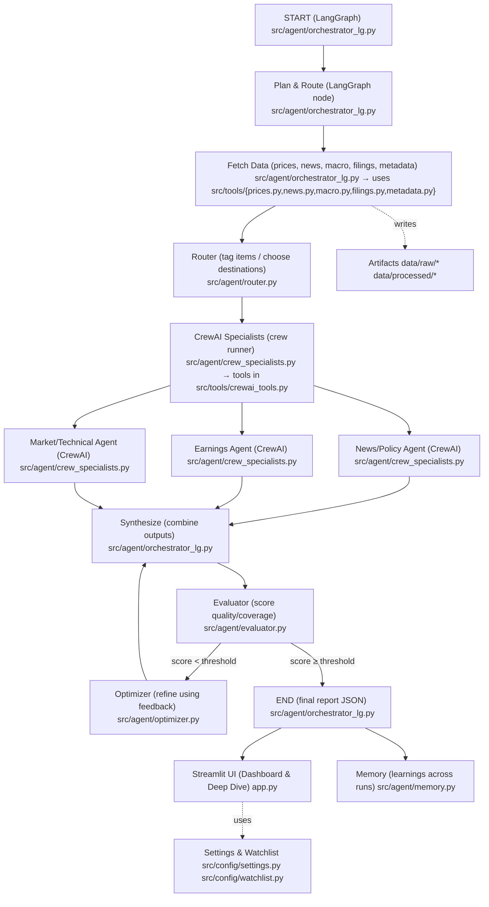

# Architecture
Below diagram renders on GitHub and VS Code with Mermaid support.

```mermaid
%%{init: {'flowchart': {'htmlLabels': false}}}%%
graph TD;
    START["START (LangGraph) src/agent/orchestrator_lg.py"] 
      --> PLAN["Plan & Route (LangGraph node)\nsrc/agent/orchestrator_lg.py"];

    PLAN --> FETCH["Fetch Data (prices, news, macro, filings, metadata) src/agent/orchestrator_lg.py → uses src/tools/{prices.py,news.py,macro.py,filings.py,metadata.py}"];
    FETCH --> ROUTE["Router (tag items / choose destinations)\nsrc/agent/router.py"];

    ROUTE --> SPECIALISTS["CrewAI Specialists (crew runner) src/agent/crew_specialists.py → tools in src/tools/crewai_tools.py"];
    SPECIALISTS --> NEWS["News/Policy Agent (CrewAI) src/agent/crew_specialists.py"];
    SPECIALISTS --> EARN["Earnings Agent (CrewAI) src/agent/crew_specialists.py"];
    SPECIALISTS --> MKT["Market/Technical Agent (CrewAI) src/agent/crew_specialists.py"];

    NEWS --> SYN["Synthesize (combine outputs) src/agent/orchestrator_lg.py"];
    EARN --> SYN;
    MKT  --> SYN;

    SYN --> EVAL["Evaluator (score quality/coverage) src/agent/evaluator.py"];
    EVAL -->|score < threshold| OPT["Optimizer (refine using feedback) src/agent/optimizer.py"];
    OPT --> SYN;

    EVAL -->|score ≥ threshold| END["END (final report JSON) src/agent/orchestrator_lg.py"];

    END --> UI["Streamlit UI (Dashboard & Deep Dive) app.py"];
    END --> MEM["Memory (learnings across runs) src/agent/memory.py"];

    %% Supporting config and data (not nodes, but used by the flow)
    UI -. uses .-> CFG["Settings & Watchlist src/config/settings.py src/config/watchlist.py"];
    FETCH -. writes .-> DATA["Artifacts data/raw/* data/processed/*"];


```
