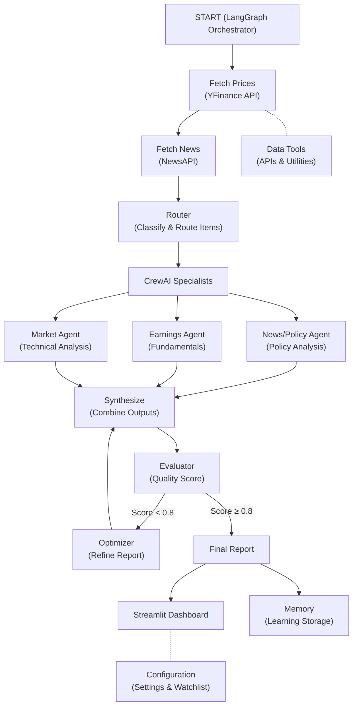

# Renewable Energy Financial Analyst - System Architecture & Team Division Strategy

## 🎯 Project Overview

This project implements an **AI-powered financial analyst system** specifically designed for renewable energy sector investment research. The system combines **LangGraph orchestration** with **CrewAI specialist agents** to provide comprehensive, data-driven investment recommendations.

### Core Value Proposition
- **Automated Research**: Combines price data, news analysis, earnings insights, and macroeconomic factors
- **Sector Expertise**: Focuses specifically on renewable energy companies (solar, wind, storage, utilities)
- **Multi-Agent Analysis**: Uses specialized AI agents for different aspects of financial analysis
- **Quality Assurance**: Built-in evaluation and optimization loop for report quality
- **Continuous Learning**: Memory system that improves analysis over time

## 🏗️ System Architecture

## 👥 Three-Member Team Division Strategy

### **Team Member 1: Agent Systems Architect** 
**Focus Areas: Core Agent Logic & Orchestration**

#### Primary Responsibilities:
- **LangGraph Orchestrator** (`src/agent/orchestrator_lg.py`)
  - Design and implement the main workflow graph
  - State management and node transitions
  - Error handling and retry logic
- **CrewAI Specialists** (`src/agent/crew_specialists.py`)
  - Define specialist agent roles and capabilities
  - Task creation and crew coordination
  - Agent communication protocols
- **Router System** (`src/agent/router.py`)
  - Intelligent content classification
  - Dynamic routing logic for different data types
  - Rule-based and ML-based routing strategies
- **Memory System** (`src/agent/memory.py`)
  - Cross-run learning implementation
  - Performance tracking and insights storage
  - Historical analysis capabilities

#### Technical Skills Required:
- LangGraph framework expertise
- CrewAI multi-agent systems
- Python async/await patterns
- State management patterns

#### Deliverables:
- Complete agent orchestration system
- Multi-agent crew coordination
- Intelligent routing mechanisms
- Learning and memory capabilities

---

### **Team Member 2: Data Tools & Integration Specialist**
**Focus Areas: External APIs, Data Processing & Tool Development**

#### Primary Responsibilities:
- **Financial Data Tools** (`src/tools/prices.py`, `src/tools/metadata.py`)
  - YFinance integration for stock prices and company metadata
  - Real-time and historical data fetching
  - Data caching and rate limiting
- **News & Information Tools** (`src/tools/news.py`, `src/tools/macro.py`, `src/tools/filings.py`)
  - NewsAPI integration for sector headlines
  - FRED API for macroeconomic data
  - SEC EDGAR for company filings
- **Tool Integration Frameworks** (`src/tools/crewai_tools_imp.py`, `src/tools/langchain_tools.py`)
  - CrewAI tool wrappers and schemas
  - LangChain tool integrations
  - Standardized tool interfaces
- **Data Pipelines** (`src/pipelines/`, `src/extractors/`, `src/summarizers/`)
  - News processing and entity extraction
  - Data transformation pipelines
  - Content summarization helpers

#### Technical Skills Required:
- API integration (REST, rate limiting, authentication)
- Data processing (pandas, numpy)
- Schema validation (Pydantic)
- External service management

#### Deliverables:
- Complete data acquisition layer
- All external API integrations
- Data processing pipelines
- Tool framework implementations

---

### **Team Member 3: Quality Assurance & User Interface**
**Focus Areas: Evaluation, Optimization & User Experience**

#### Primary Responsibilities:
- **Evaluation System** (`src/agent/evaluator.py`)
  - Report quality scoring algorithms
  - Coverage and completeness metrics
  - Citation and source validation
- **Optimization Engine** (`src/agent/optimizer.py`)
  - Iterative report refinement
  - Confidence score improvement
  - Content enhancement strategies
- **Streamlit Application** (`app.py`)
  - Interactive dashboard design
  - User experience optimization
  - Real-time data visualization
- **Configuration & Settings** (`src/config/`)
  - Environment management
  - Watchlist curation (renewable energy companies)
  - Logging and monitoring setup
- **Testing & Quality** (`tests/`, `Makefile`)
  - Unit test development
  - Integration testing
  - Code quality tools (black, flake8, pytest)

#### Technical Skills Required:
- Streamlit framework
- Data visualization (matplotlib, plotly)
- Testing frameworks (pytest)
- Code quality tools and CI/CD

#### Deliverables:
- Quality evaluation and optimization systems
- Complete user interface
- Testing suite and quality assurance
- Configuration management

## 🔄 Workflow Execution Strategy

### Phase 1: Foundation (Weeks 1-2)
- **Member 1**: Basic LangGraph orchestrator skeleton
- **Member 2**: Core data tool implementations (prices, basic news)
- **Member 3**: Streamlit UI mockup and evaluation framework structure

### Phase 2: Integration (Weeks 3-4)
- **Member 1**: CrewAI agents implementation and routing logic
- **Member 2**: Complete API integrations and tool wrappers
- **Member 3**: Working UI with basic evaluation system

### Phase 3: Enhancement (Weeks 5-6)
- **Member 1**: Memory system and advanced orchestration features
- **Member 2**: Data pipeline optimization and caching
- **Member 3**: Advanced evaluation metrics and report optimization

### Phase 4: Testing & Deployment (Week 7-8)
- **All Members**: Integration testing, bug fixes, documentation
- **Member 3**: Comprehensive testing suite and deployment preparation

## 🎯 Key Technical Decisions

### **Why LangGraph + CrewAI?**
- **LangGraph**: Provides robust state management and conditional workflows
- **CrewAI**: Enables specialized agent roles with domain expertise
- **Combination**: Best of both worlds - orchestration + specialization

### **Data Architecture**
- **Real-time**: Live market data via YFinance
- **News**: Sector-specific renewable energy coverage
- **Quality**: Multi-layered evaluation and optimization
- **Learning**: Persistent memory for continuous improvement

### **Scalability Considerations**
- Modular tool architecture for easy API additions
- State-based workflow for complex analysis scenarios
- Caching layer for performance optimization
- Configuration-driven behavior for different market conditions

## 📊 Success Metrics

1. **Analysis Quality**: Evaluation scores > 0.8 consistently
2. **Coverage**: All major renewable energy subsectors represented
3. **Performance**: Analysis completion < 30 seconds per company
4. **Accuracy**: Investment recommendations validated against market performance
5. **User Experience**: Intuitive dashboard with clear actionable insights

## 🎯 System Flow Explanation

### **Step-by-Step Workflow:**

1. **🚀 Initialization**: User selects a renewable energy company (e.g., FSLR - First Solar)

2. **📈 Data Fetching**: 
   - Fetch historical price data and company metadata
   - Retrieve recent news articles and sector headlines
   - Optional: Fetch macroeconomic indicators and SEC filings

3. **🔀 Intelligent Routing**: 
   - Classify news items by type (earnings, policy, market trends)
   - Route different content types to appropriate specialist agents
   - Apply renewable energy sector filters

4. **👥 Specialist Analysis**:
   - **News/Policy Agent**: Analyzes regulatory changes, subsidies, policy impacts
   - **Earnings Agent**: Reviews financial fundamentals, guidance, margins
   - **Market Agent**: Performs technical analysis, momentum indicators

5. **🔄 Synthesis**: Combine all specialist outputs into comprehensive analysis

6. **🎯 Quality Evaluation**: Score the report for completeness, accuracy, citations

7. **⚡ Optimization Loop**: If quality score < 0.8, refine and improve the report

8. **📋 Final Report**: Generate investment recommendation (BUY/WATCH/AVOID) with confidence score

9. **🧠 Learning**: Store results and critiques for future improvement

This architecture enables a sophisticated, production-ready financial analysis system while maintaining clear team responsibilities and deliverable ownership.
